# Multilayer Perceptron (MLP) implementation with Numpy

**PROJECT BACKGROUND**

This project is part of a series of assignments for COMP5329 - Deep Learning for the Masters Degree in Data Science at The University of Sydney. 

The goal of this project is to implement a neural network without the use of modern machine learning libraries. By doing so, we will showcase the effects of different methods/components to  the overall quality of our MLP model on the provided dataset. 

The dataset consists of 60,000 data points in split into train (50,000) and test (10,000). Each datapoint consists of 128 floating-point numerics, split equally across 10 classes. The dataset was randomly generated by an unspecified algorithm and course participants were given free reign to define technical objective and methods.

**Table of Content:**
- [Technical Objectives](#a-technical-objectives)
- [Exploratory Data Analysis and Pre-Processing](#b-exploratory-data-analysis-and-pre-processing)
- [Modules Used in This Project](#c-modules-used-in-this-project)
- [Putting It All Together](#d-putting-it-all-together)
- [Experiment Protocol and Results](#e-experiment-protocol)
- [Summary Output](#f-summary)
- [Discussion](#g-discussion)
- [Appendix](#h-appendix)

## A. TECHNICAL OBJECTIVES

We define our quality metrics as a mix of test scores, training speeds, and model simplicity:

1. `Test scores`: we track both accuracy and F1-scores for conservatism. We note that accuracy is more appropriate for datasets which are balanced and projects with emphasis on the identification of true positives and true negatives. On the other hand, F1-score is more appropriate for datasets which are imbalanced and the ability to identify true and false positives and negatives is more important. 

  **NOTE**: the absolute values of test scores are meaningless by themselves due to the random nature of our dataset. Test scores are only useful for comparison purposes between two or more models.


2. `Training speeds`: we focus on employing methods which are efficient with low training speeds.

3. `Simplicity`: we provide evidence-based arguments on which methods/components are best fit for this specific dataset. For equivalent scores and speeds, we will opt for the methods/components which are easier to use/maintain. 

## B. EXPLORATORY DATA ANALYSIS AND PRE-PROCESSING

<p align="center">
  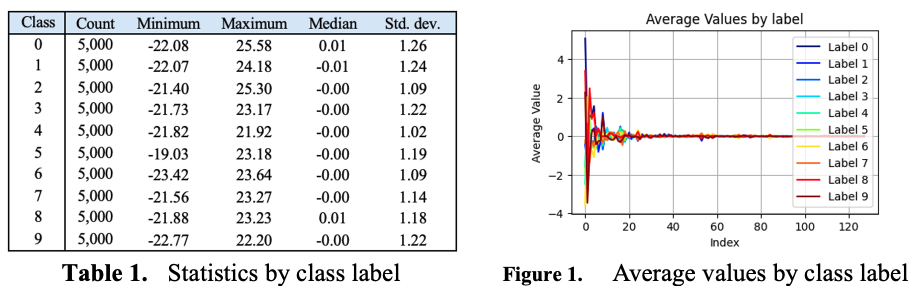
  <br>
  Our dataset distribution. The majority of variance are observed between index values 0 to 25.
</p>

Pre-processing notes:

1. `Normalization`: Train and test data were normalized using the Z-score normalisation technique where data was subtracted with the train mean and divided by train standard deviation. This transforms the train data to mean of 0 and standard deviation 1 which is appropriate for a neural network. The mean and median of train data is used to pre-process validation and test sets as well.

2. `No dimensionality reduction is applied`: sparsity of a dataset is a feature that is useful for a deep learning network and is kept for this exercise.

3. `Train and validation split`: the original training dataset is further split into training (80%) and validation (20%) dataset. The implementation of validation checks helps with detecting overfitting during training through the implementation of early stopping (explained below). 

## C. MODULES USED IN THIS PROJECT

<p align="center">
  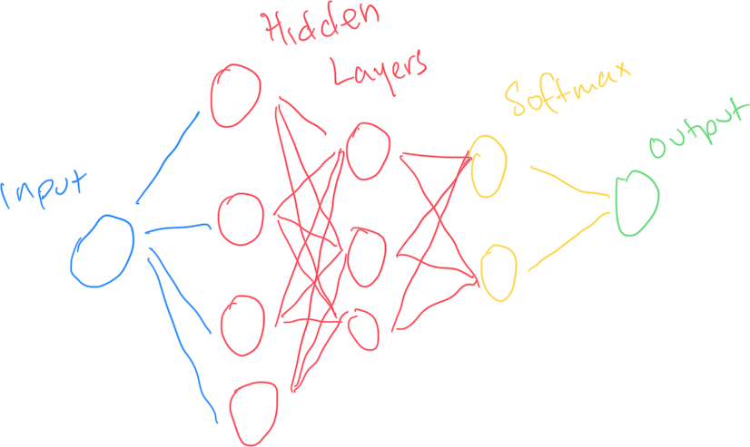
  <br>
  A simplified view of an MLP network.
</p>

**Note**: Snippets of base code are provided below to showcase how each component functions. These snippets are taken from the implementation code which is structured as three main classes: (i) **Activations**: this houses all activation functions, (ii) **HiddenLayer**: this houses all methods, (iii) **MLP**: this houses the training, eval, predict functions as well as mini-batch.


`Base architecture`: deep learning models consists of input, hidden, and output layers through which information is propagated and processed through. A model may have one or more hidden layers and the choice of optimal number of hidden layers can be determined by considering test scores and run times. Deeper and wider models can learn more parameters from input at higher computational costs, vice versa. As information is propagated through the neural network, each neuron (e.g. a single node in the neural network) takes in one or more input multiplied by weights and adjusted by a bias factor to produce an adjusted input. The adjusted input is then further processed through a non-linear activation function to produce a convex output for that layer. The process outlined below are repeated until all training data has been ingested. A complete cycle of training loop (e.g. when all training data has been used once) is called an `epoch`.

The training process consists of the following processes:

- `Forward pass (left to right)`: (i) input data is propagated forward through a linear transformation to match the output dimension, (ii) the transformed input is then processed through the activation function to create a transformed output for the given layer, (iii) the output of each layer is then passed as input for the layer after it, which allows chaining of functions in each layer, (iv) predicted output is produced in the output layer, at the end of the forward pass. 

```python
def forward(self, input, dropout_rate, is_train = True, batchnorm_switch = True):

  #linear transformation
  lin_output = np.dot(input, self.W) + self.b 
  
  #batchnorm
  if batchnorm_switch:
      lin_output = self.batchnorm_forward(lin_output, is_train)

  self.output = lin_output

  #dropout
  self.dropout(is_train, dropout_rate)
  
  if self.activation:
      self.output = self.activation(self.output)
  
  self.input=input

  return self.output
```

- `Loss calculation`: an objective function / loss function is used to calculate the degree of error between actual and predicted output. The loss function produces a larger output for a larger error, vice versa. This allows the model to compute gradients and adjust parameters to self-correct its prediction during the backward pass. The loss function used in this model is the 'criterion cross entropy', which is commonly used for multi-class classifications.

```python
def criterion_cross_entropy(self, y, y_hat, batch_size, eps=1e-9):
    
  activation_deriv=Activation(self.activation[-1]).f_deriv
  
  #one hot encode y to match shape of y_hat, value is 0 everywhere, 1 for the positive column
  num_classes = y_hat.shape[1] 
  num_samples = y.shape[0]
  y_one_hot = np.zeros((num_samples,num_classes)) 
  y = y.flatten().astype(int)
  y_one_hot[np.arange(num_samples),y] = 1 

  # calculate loss, add epsilon to avoid log 0
  loss = np.sum(- y_one_hot * np.log(y_hat + eps)) /  batch_size #adjusting loss by batch_size for minibatch
  
  #calculate delta of output layer 
  delta = activation_deriv(y_hat, y_one_hot)

  #return loss and delta
  return loss, delta
```

- `Backward pass (right to left)`: Errors from the predicted output can be used to calculate gradients from the output layer, all the way to the input layer via chain rule. Gradients descent is the ‘step’ taken toward the direction which minimizes the loss function. This direction of loss minimization can be calculated as the derivative of the loss function. The resulting derivative value is then multiplied to the learning rate to determine the size of step taken.

```python
def backward(self, delta, batchnorm_switch):         

  #gradient
  self.grad_W = np.dot(np.atleast_2d(self.input).T, np.atleast_2d(delta))
  self.grad_b = np.sum(delta, axis = 0) 

  #dropout
  delta *= self.dropout_mask

  #batchnorm
  if batchnorm_switch:
      delta = self.batchnorm_backward(delta)

  #linear transformation
  if self.activation_deriv: 
      delta = np.dot(delta, self.W.T) * self.activation_deriv(self.input)


  return delta
```

- `Update`: Weights and biases of the neurons in each layer are updated according to the gradient calculated during via gradient descent. 

```python
def update(self,momentum_gamma,lr, weight_decay, batchnorm_switch, adam_switch, adam_learning_rate):

  for layer in self.layers:
      assert layer.W.shape == layer.grad_W.shape, f'mismatch in W{layer.W.shape} and grad_W {layer.grad_W.shape} shapes'
      assert layer.b.shape == layer.grad_b.shape, f'mismatch in b {layer.b.shape} and grad_b shapes {layer.grad_b.shape}'
      
      #call momentum from HiddenLayer to update V values
      layer.momentum(momentum_gamma,lr)
      
      #call weightdecay from hiddenlayer to update V values
      layer.weightdecay(lr, weight_decay)

      #apply adjustments to V_W to W
      if adam_switch:
          self.adam_counter += 1
          adam_W, adam_b = layer.adam(self.adam_counter, adam_learning_rate = adam_learning_rate, beta1 = 0.9, beta2 = 0.99, eps = 1e-9, adam_switch = True)
          layer.W -= adam_W
          layer.b -= adam_b
      else:
          layer.W -= layer.V_W
          layer.b -= layer.V_b

      #batchnorm update
      if batchnorm_switch:
          layer.gamma -= lr * layer.grad_gamma
          layer.beta -= lr * layer.grad_beta
```


`Activation functions`: are mathematical functions used in neurons which applies non-linearity to input and produces convex output. Activation functions implemented in the model are explained below:

  - `Sigmoid`: The sigmoid function is mostly used for binary classifications and probability calculations where it splits its output into values between 0 and 1 across a logistic function s-curve. 

  - `Tanh`: The tanh function resembles the sigmoid function with a range of –1 to 1. Tanh allows a wider coverage where negative inputs will be reflected.

  - `Rectified Linear Unit (‘ReLU’)`: widely used activation function in hidden layers of  neural networks. ReLU consists of two linear pieces: it defaults to zero for negative input and preserves values for positive input. ReLU is simple to implement and creates models that generalizes well. However, the tendency to create zero outputs may cause ‘dead’ neurons, whereby a neuron do not function because its input are zero.

  - `Leaky ReLU`: An alternate form to the ReLU activation function used to address ‘dead’ neurons. The leaky ReLU multiplies a small factor to negative input (instead of defaulting to zero) and preserves values for positive input. As such, the Leaky ReLU always produces some value which can be used in the proceeding layer as input, solving the ‘dead’ neuron problem. 

  - `Softmax`: The softmax function is commonly used in the output layer for multi classifications where a probability value is allocated to classes of the data. 

```python
class Activation(object):
  
  #tanh
  def __tanh(self, x):
      return np.tanh(x)
  def __tanh_deriv(self, a):
      return 1.0 - a**2
  
  #sigmoid/logistic
  def __logistic(self, x):
      return 1.0 / (1.0 + np.exp(-x))
  def __logistic_deriv(self, a):
      return  a * (1 - a )
  
  #relu
  def __relu(self, x):
      if np.isnan(x).any() or np.isinf(x).any():
          print("Detected NaN or Inf in x at relu")
      return np.maximum(0,x)
  def __relu_deriv(self, a):
      return np.where(a>0,1,0)
  
  #leaky relu
  def __lrelu(self,x):
      return np.maximum(0.01*x,x)
  
  def __lrelu_deriv(self, a):
      return np.where(a>0,1,0.01)
  
  #softmax
  def __softmax(self,x, eps=1e-9): 
      if np.isnan(x).any() or np.isinf(x).any():
          print("Detected NaN or Inf in x at softmax")
      exps = np.exp( x -np.max(x, axis =-1, keepdims = True))
      
      return exps / np.sum(exps, axis =-1, keepdims = True) + eps

  def __softmax_deriv(self,yhat, y_one_hot):
      return yhat - y_one_hot 

  def __init__(self,activation='tanh'):
      if activation == 'logistic':
          self.f = self.__logistic
          self.f_deriv = self.__logistic_deriv
      elif activation == 'tanh':
          self.f = self.__tanh
          self.f_deriv = self.__tanh_deriv
      elif activation == 'relu':
          self.f = self.__relu
          self.f_deriv = self.__relu_deriv
      elif activation == 'softmax':
          self.f = self.__softmax
          self.f_deriv = self.__softmax_deriv
      elif activation == 'lrelu':
          self.f = self.__lrelu
          self.f_deriv = self.__lrelu_deriv
```

To speed up the training process and increase model robustness, several methods can be used:

- `Batch size`: a higher batch size increases the training speed as it takes more than one data point in a single training epoch. However, higher batch sizes produces fewer parameter updates, which may adversely impact test scores. 
    
    - Batch size of 1 (also known as the Stochastic Gradient Descent or `SGD`): SGD takes one randomly selected data point for each iteration of the training loop. A single epoch of training requires the SGD to be until all training data is used up once (e.g. one epoch takes n number of iterations, with n being the length of the dataset).  The SGD may produce a more volatile error curve and take a very long time to converge as it calculates curves and updates parameters one-by-one, for every random data point during an epoch.

    - `Batch Gradient Descent`: On the contrary, the Batch Gradient Descent takes the entire dataset in each iteration of the training loop at once (e.g. one epoch is one iteration). This method can be useful if the data size is small and simplistic but may be cumbersome due to the large matrix multiplication done every iteration. Batch Gradient Descent produces a smoother error curve but may get stuck in local minima.

    - `Mini Batch Gradient Descent` takes a batch size value between SGD and Batch Gradient Descent.  The Mini Batch Gradient Descent is beneficial as it is customizable to match the existing computing capacity and characteristic of the dataset, thus achieving some computing benefits while maintaining some fineness of SGD. 

```python
def getBatch(self, X,y, batch_size):
  # minibatch implementation drops last batch to ensure consistency/stability of training data fed to the model.
  if batch_size <= X.shape[0]:
    # for loop drops the last batch, just in case it is too small
    for start_index in range(0, X.shape[0] - batch_size + 1, batch_size):
        end_index = min(start_index + batch_size, X.shape[0])
        yield X[start_index:end_index], y[start_index:end_index]
```

- `Regularization`: are techniques/methods used to avoid overfitting. Deep learning models are prone to “memorizing” patterns of dataset it is trained on, which decreases its ability to generalize when presented with an unseen dataset. Several regularization techniques used in this study: 

   - `Early stopping`: allows the model to stop training early when the model performance does not improve during evaluation. Specific to this study, early stopping is divided into two stages: (i) Stage 1: the model is trained on the training dataset and is evaluated periodically on the validation set. This stage is stopped when validation score does not improve after a specified number of cycles, (ii) Stage 2: The training process is continued on the combined training and validation datasets until the model achieves the training score at the end of Stage 1 or the maximum number of epochs is reached. Note: early stopping is used in our experiments to limit the number of epochs run and maintain computing efficiency.

<p align="center">
  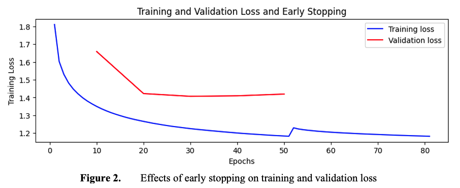
  <br>
  Impact of early stopping to training loss.
</p>

   - `Weight decay`: adds a penalty to the loss function which slows down parameter updates by multiplying gradients with a gamma factor. Weight decay must be implemented with a degree of conservatism as too high a gamma value may entrap the model in a local minimum.

```python
def weightdecay(self, lr, weight_decay):
    self.W += lr * (weight_decay * self.W)
```

   - `Dropout`: removes neurons from the hidden layers based on the probability p% to ensure network robustness. By switching off nodes randomly, dropout forces the use of nodes otherwise ignored without dropout. Dropout effectively implements model parallelization which increases robustness but also increases the size and iteration of the model.  

```python
def dropout(self, is_train, dropout_rate):
    
  if is_train and dropout_rate > 0.0:
    self.dropout_mask = (np.random.rand(*self.output.shape) < (1 - dropout_rate))
    if np.isnan(self.dropout_mask).any() or np.isinf(self.dropout_mask).any():
      print("Detected NaN or Inf in dropout_mask in dropout")
      
  else:
    self.dropout_mask = np.ones_like(self.output)        

  self.output *= self.dropout_mask
  self.output *= 1/(1-dropout_rate)
```

   - `Momentum in SGD`: the Stochastic gradient descent has some weaknesses in deep learning whereby it may get stuck in a region where the gradients are flat (also known as 'saddle points'). The use of momentum helps our gradient descent to escape these saddle points so it is less likely to get stuck. Note: Momentum is indirectly implemented through ADAM optimizer for this exercise.

```python
def momentum(self, momentum_gamma, lr):
        
  self.V_W = momentum_gamma * self.V_W + lr * self.grad_W
  self.V_b = momentum_gamma * self.V_b + lr * self.grad_b 
```


   - `Batch normalization`: as data is processed and transformed in each hidden layer, its value may not be properly fed to later layers in a deep learning model. This is known as co-variate shift. Batch normalization reparametrizes the input of each layer using z-score normalization stated above to remove the effects of covariate shift in deeper networks and it allows the full use of all nodes in every layer. Batch normalization provides net benefits in overall run-times, even if the individual epoch runtimes increase due to additional calculation involved in normalizing input for every layer. Batch normalization introduces additive and multiplicative noise which presents a regularizing effect, making dropout unnecessary. 

  <p align="center">
    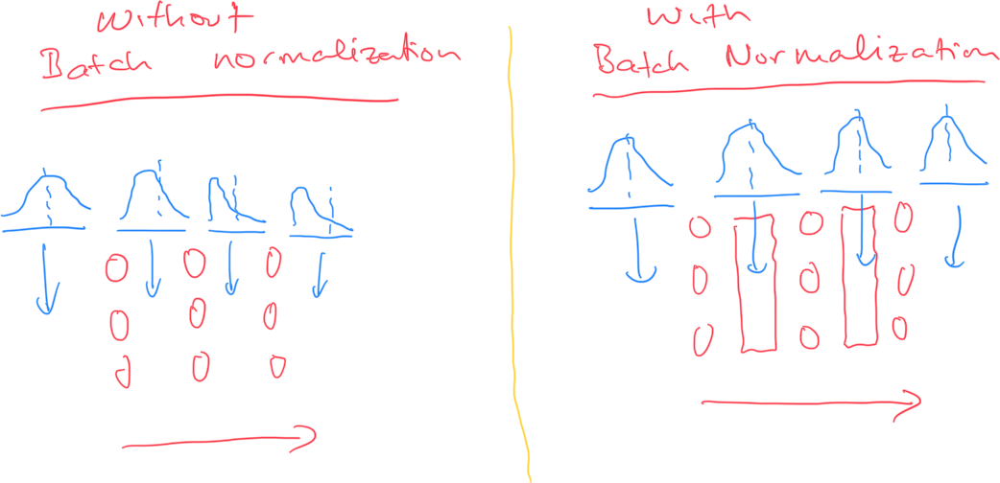
    <br>
    Batch normalization alleviates the impact of covariate shift. All nodes are properly fed with information.
  </p>

```python
def batchnorm_forward(self,input, is_train = True, bn_momentum = 0.9, eps = 1e-9):

  if self.gamma is None:
    self.gamma = np.ones((input.shape[-1]))
    self.beta = np.zeros((input.shape[-1]))
    self.grad_gamma = np.ones((input.shape))
    self.grad_beta = np.zeros((input.shape[-1]))

  if is_train:
    #calculate mean, variance, and normalized input
    batch_mean = np.mean(input, axis = 0)
    batch_var = np.var(input, axis = 0)
    batch_std = np.sqrt(batch_var + eps)
    input_centered = input - batch_mean
    input_normalized = input_centered/np.sqrt(batch_var + eps) #epsilon introduced to avoid divide by zero

    #use self.cache so values can be reused during backward pass
    self.cache = (input, input_normalized, batch_mean, batch_var)

    output = input_normalized * self.gamma + self.beta

    self.running_mean = bn_momentum * self.running_mean + (1-bn_momentum) * batch_mean
    self.running_var = bn_momentum * self.running_var + (1-bn_momentum) * batch_var

    self.cache = (input_normalized, input_centered, batch_std)

  else:
    input_normalized = (input - self.running_mean)/np.sqrt(self.running_var + eps)
    output = self.gamma * input_normalized + self.beta

  return output

def batchnorm_backward(self, delta):

  #print('start bn backward')
  output_normalized, output_centered, batch_std = self.cache
  
  N,D = delta.shape
  
  self.grad_gamma = np.sum(delta * output_normalized, axis = 0)
  self.grad_beta = np.sum(delta, axis = 0)

  dx_normalized = delta * self.gamma
  dx_centered = dx_normalized / batch_std
  dmean = np.sum(-dx_centered, axis = 0) + 2/N * np.sum(output_centered, axis=0)
  dstd = np.sum((dx_normalized * output_centered * - batch_std**(-2)), axis = 0)
  dvar = dstd / 2/ batch_std
  dx = dx_centered + (dmean + dvar * 2 * output_centered) / N
  return dx
```

   - `ADAM optimisation`: ADAM is an optimization technique created to utilise first and second moments to adapt the learning rate. Compared to the previous optimisation    technique such as RMSprop and AdaGrad where only the second moment is used, the ADAM optimisation converges quicker and develop resistance to noise in a dataset. ADAM optimizers contain the capabilities from SGD with momentum as well as RMSprop, which means it could decrease and increase the learning rate through the manipulation of the beta values depending on how large the gradient is.

```python
def adam(self, iter, adam_learning_rate = 0.1, beta1 = 0.9, beta2 = 0.99, eps = 1e-9, adam_switch = True):

  #momentum
  self.V_dW = beta1 * self.V_dW + (1-beta1) * self.grad_W
  self.V_db = beta1 * self.V_db + (1-beta1) * self.grad_b
  
  #rms prop
  self.S_dW = beta2 * self.S_dW + (1-beta2) * (self.grad_W ** 2)
  self.S_db = beta2 * self.S_db + (1-beta2) * (self.grad_b ** 2)
  
  #correction
  self.V_dW = self.V_dW / (1 - (beta1 ** iter))
  self.V_db = self.V_db / (1 - (beta1 ** iter))
  self.S_dW = self.S_dW / (1 - (beta2 ** iter))
  self.S_db = self.S_db / (1 - (beta2 ** iter))

  #calculate adjustments
  adam_W = adam_learning_rate * self.V_dW / (np.sqrt(self.S_dW)+eps)
  adam_b = adam_learning_rate * self.V_db / (np.sqrt(self.S_db)+eps)
  
  return adam_W, adam_b
```

## D. PUTTING IT ALL TOGETHER

- `train loop`: this helper function simplifies the loops used in `fit` below. It consists of forward propagation, cross entropy calculation, backward propagation, and parameter update.

```python
def train_loop(self, X, y, batch_size, dropout_rate, momentum_gamma, learning_rate, weight_decay, batchnorm_switch, adam_switch, adam_learning_rate):
               
  total_loss = 0 
  batches = 0 
  
  for X_batch, y_batch in self.getBatch(X,y,batch_size):
      # forward pass
      y_hat = self.forward(X_batch, dropout_rate, batchnorm_switch, is_train = True)
      
      # compute loss and gradient
      loss,delta=self.criterion_cross_entropy(y_batch,y_hat, batch_size)

      #backward pass
      self.backward(delta, batchnorm_switch)

      # update
      self.update(momentum_gamma, learning_rate, weight_decay, batchnorm_switch, adam_switch, adam_learning_rate)

      #record batch loss in batch losses
      batch_loss = np.mean(loss)
      batches += 1
      total_loss += batch_loss

  epoch_loss = total_loss / batches

  return epoch_loss
```

- `fit`: this function executes the training and validation loops until early stopping is triggered, after which the training and validation datasets are combined and training continued until it reaches the same level of training loss.

```python
def fit(self,X_train,y_train, X_val, y_val, momentum_gamma =0.9, learning_rate=0.1, epochs=100, batch_size =1, weight_decay = 0.01, dropout_rate = 0.0, early_stopping =[5,10], batchnorm_switch = True, adam_switch = True, adam_learning_rate = 0.1):
    
    #check if train and val data were provided
    validate_check = len(X_val) > 0 and len(y_val) > 0
    if validate_check is False:
        print('No validation data provided, skipping validation step')

    #instantiate toggles for early_stopping
    is_early_stop = False
    last_validation_loss = float('inf') if validate_check else None
    epoch = 0
    count = 0
    MAX_COUNT = early_stopping[0]
    EVAL_TRIGGER = early_stopping[1]

    # assign X_train and y_train to X and y 
    X=np.array(X_train)
    y=np.array(y_train)
    epoch_losses = []
    val_losses = []
    
    #start adam_counter at 0
    self.adam_counter = 0
    
    for k in range(epochs):
        epoch_loss = self.train_loop(X, y, batch_size, dropout_rate, momentum_gamma, learning_rate, weight_decay, batchnorm_switch, adam_switch, adam_learning_rate)
        epoch_losses.append(epoch_loss)

        #implement early stop
        if validate_check and k % EVAL_TRIGGER == 0:
            current_validation_loss = self.eval(X_val, y_val, dropout_rate, batchnorm_switch)
            
            if current_validation_loss > last_validation_loss:
                count += 1

                if count == MAX_COUNT:
                    is_early_stop = True
                    early_stop_train_score = epoch_loss
                    break
            
            else:
                last_validation_loss = current_validation_loss
                count = 0

            if not is_early_stop:
                val_losses.append(current_validation_loss)
                
        epoch += 1

    if validate_check and is_early_stop:
        X_combined = np.concatenate((X_train, X_val))
        y_combined = np.concatenate((y_train, y_val))

        while epoch < epochs:
            epoch +=1
            epoch_loss = self.train_loop(X_combined, y_combined, batch_size, dropout_rate, momentum_gamma, learning_rate, weight_decay, batchnorm_switch, adam_switch, adam_learning_rate)
            epoch_losses.append(epoch_loss)
            
            if epoch_loss < early_stop_train_score:
                break

    return epoch_losses, val_losses, epoch
```

- `predict`: This function allows us to generate predicted output

```python
# define the prediction function
    def predict(self, x, dropout_rate, batchnorm_switch):
        x = np.array(x)
        output = np.zeros((x.shape[0], 1))  # Prepare output array to store predicted class labels
        for i in np.arange(x.shape[0]):
            probabilities = self.forward(x[i, :],dropout_rate, batchnorm_switch, is_train = False)  # Get the softmax probabilities
            predicted_class = np.argmax(probabilities)  # Choose the class with the highest probability
            output[i] = int(predicted_class)  # Assign the predicted class to the output array
        return output
```

- `eval`: this function calculates validation loss. This is function does similar calculations to `predict` and is sepearated out for code hygiene.

```python
def eval(self, X_val, y_val, dropout_rate,batchnorm_switch):

  X_val = np.array(X_val)
  y_val = np.array(y_val)
  yhat_val = self.forward(X_val, dropout_rate, batchnorm_switch, is_train=False) 
  val_loss, _ = self.criterion_cross_entropy(y_val,yhat_val, len(y_val))
  return np.mean(val_loss)
```

- `Hyperparameter tuning`: this function implements hyperparameter tuning with for loops and is customised to our use case. 

```python
def hyperparamater_testing(parameters):
    
  learning_rates,batch_sizes,early_stopping_combination, epoch_counts, momentum_gammas, weight_decays, dropouts, batchnorm_switches,adam_learning_rates, node_counts,node_activations = parameters
  sumproduct = (len(learning_rates) * len(batch_sizes) * len(early_stopping_combination) * len(epoch_counts) * len(momentum_gammas) * len(weight_decays) * len(dropouts) * len(batchnorm_switches) * len(adam_learning_rates) * len(node_counts))
  print(f'Running {sumproduct} cases.')

  assets = []
  counter = 0
  for early_stopping in early_stopping_combination:
      for batch_size in batch_sizes:
          for lr in learning_rates:
              for epoch_count in epoch_counts:
                  for momentum_gamma in momentum_gammas:
                      for weight_decay in weight_decays:
                          for dropout in dropouts:
                              for batchnorm_switch in batchnorm_switches:
                                  for adam_learning_rate in adam_learning_rates:
                                      
                                      if adam_learning_rate > 0:
                                          adam_switch = True
                                      else: adam_switch = False

                                      for (node_count, node_activation) in zip(node_counts, node_activations):
                                          
                                          nn = MLP(node_count, node_activation)

                                          start_time = time.time()

                                          train_loss, val_loss, epoch = nn.fit(train_data, train_label, val_data, val_label, 
                                                          momentum_gamma = momentum_gamma, learning_rate = lr, 
                                                          epochs = epoch_count, batch_size = batch_size, 
                                                          weight_decay = weight_decay, dropout_rate = dropout, 
                                                          early_stopping = early_stopping, batchnorm_switch = batchnorm_switch, 
                                                          adam_switch = adam_switch, adam_learning_rate = adam_learning_rate)
                                          
                                          end_time = time.time()

                                          duration = end_time - start_time
                                          duration_minutes, duration_seconds = int(duration // 60), int(duration % 60)

                                          train_predict = nn.predict(train_data, dropout_rate = 0, batchnorm_switch = batchnorm_switch)
                                          test_predict = nn.predict(adj_test_data, dropout_rate = 0, batchnorm_switch = batchnorm_switch) 
                                          
                                          train_accuracy, train_f1 = accuracy_score(train_label, train_predict), f1_score(train_label, train_predict, average='weighted')
                                          test_accuracy, test_f1 = accuracy_score(original_test_label, test_predict), f1_score(original_test_label, test_predict, average='weighted')
                                      
                                          #print(f"CASE {counter}   >>> duration: {duration_minutes}m{duration_seconds}s")

                                          counter += 1
                                          assets.append({
                                              'case': counter,
                                              'early_stopping': early_stopping,
                                              'batch_size': batch_size,
                                              'learning_rate': lr,
                                              'duration_minutes': duration_minutes,
                                              'duration_seconds': duration_seconds,
                                              'epochs': epoch,
                                              'train_loss': train_loss,
                                              'val_loss': val_loss,
                                              'train_accuracy': train_accuracy,
                                              'train_f1': train_f1,
                                              'test_accuracy': test_accuracy,
                                              'test_f1': test_f1,
                                              'node_count': node_count,
                                              'node_activation': node_activation,
                                              'batchnorm_switch': batchnorm_switch,
                                              'dropout_rate':dropout,
                                              'weight_decay':weight_decay,
                                              'adam_learning_rate': adam_learning_rate,
                                              'momentum_gamma':momentum_gamma
                                          })

  return assets
```

## E. EXPERIMENT PROTOCOL AND RESULTS

`Efficient experiment protocol`: The experiment is conducted in stages to trim ‘paths’ that are unlikely to lead to a better model. In other words, we iteratively decide which parameters to tweak at every step, based on the available results. By implementing our experiment in stages, the total number of ‘paths’ explored are additive between consecutive experiments, whereas it would be multiplicative if we done exhaustively. This strategy allows us to save on computational resources and achieving acceptable runtimes. 

<p align="center">
  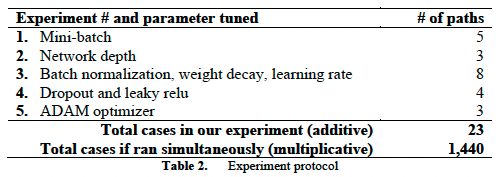
  <br>
  We only explore combination which heurestically makes sense
</p>

- **Experiment I: Impact of minibatch**

    In this experiment, we tested multiple values of batch sizes while keeping all other parameters constant. Duration and test scores were compared to defined performance and decide on parameters to be used in the next experiments. Results are displayed in Table 3 and Figure 3 below. batch size of 1 (which is the Stochastic Gradient Descent) is the slowest of all as it inefficiently does a forward pass, backward pass, and update for every single training data in every epoch. Batch size of 100 displays the best balance between speed and test score performance.

    Decision: batch size 100 to be used in the next experiment.

<p align="center">
  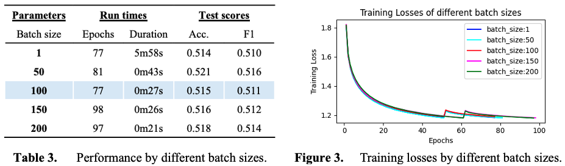
  <br>
  Impact of minibatch
</p>    

- **Experiment II: Impact of deeper MLP**

    In this experiment, we tested the performance of multiple hidden layers to gauge if any improvement to the previous model can be achieved. Results are displayed in Table 4 and Figure 4 below. Results suggest that one and two hidden layers provide the best test scores at acceptable run times. There was no evidence of superiority of three hidden layers as it took longer to converge at lower test scores. The onset of overfitting can be observed starting with 2 hidden layers.

    Decision: Two hidden layers with batch size 100 to be further tested with regularization methods. One hidden layer with batch size 100 to be considered as a possible best model.

<p align="center">
  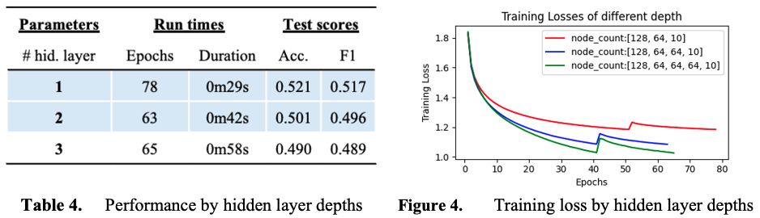
  <br>
  Impact of MLP depth
</p>  

- **Experiment III: Impact of batch normalization and weight decay**

    In this experiment, the team tested the implementation of batch normalization and weight decay to regularize the model and if higher learning rates can be applied to aid run times. Results are displayed in Table 5 and Figure 5 below. From the results, batch normalization increased run-times but improved test scores while weight decay appears ineffective in most cases. The implementation of higher learning rate, batch normalization, and weight decay appears to work well and resulted in the highest test score combination among all. Implementation of batch normalisation allow the model to stabilize the features of a dataset and avoid co-variate shift within the hidden layers. However, it should be noted that the implementation of batch normalization could decrease the overall model sensitivity to weight changes. This effect reduces the efficacy of weight decay, as can be seen by the modest test score uplift in Table 5.
    
    Decision: Batch normalization to be implemented with learning rate 0.01 and without weight decay in the next experiments to maintain simplicity and faster run-time. Weight decay only provides modest test score improvements at high run time cost.

<p align="center">
  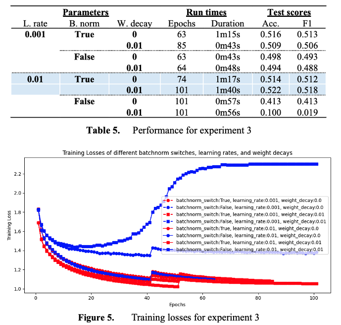
  <br>
  Impact of batch normalization and weight decay
</p>  

- **Experiment IV: Impact of dropout**

    This experiment aims to explore the impact of dropout (e.g. deactivating nodes at random to build robustness) and the implementation of leaky ReLU in conjunction with dropout. Results are displayed in Table 6 and Figure 6 below. 
    
    Dropout results are worse in terms of test scores and runtimes. There are several reasons that could explain this result: 
    i.	The dataset and neural network is small/shallow. Adding dropout to a shallow model hurts performance by switching off too many relevant nodes and not letting information pass through properly,
    ii.	ReLU (which outputs zeros for negative values) is applied to a dataset that is centred around zero. This means that a large proportion of input will be zero and will not flow through the nodes (e.g. the ‘dead’ neuron problem). Adding dropout to this worsens the dead neuron problem and adversely impacts the model’s performance. 
    iii.	The team implemented leaky ReLU to alleviate this issue. Although performance increased, the implementation of dropout still produces an inferior model. 

    Decision: Dropout will not be implemented in the follow-on experiments. Leaky relu will be used as activation as it displays better combination of test scores with lower run times.

<p align="center">
  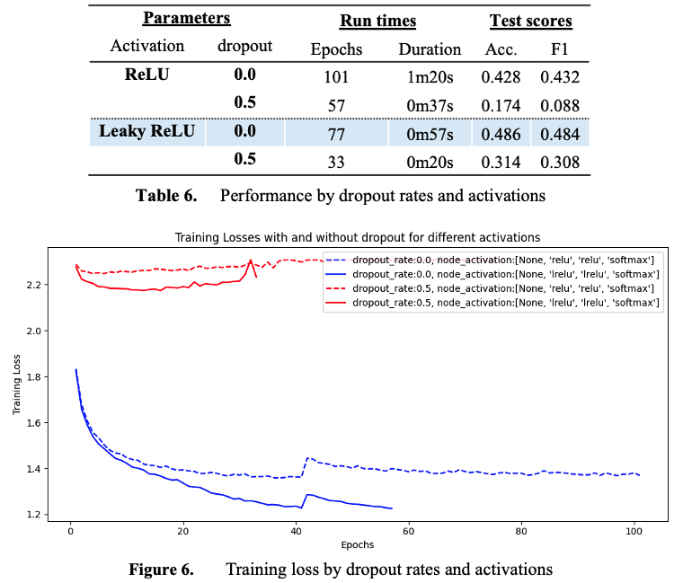
  <br>
  Impact of dropout
</p>

- **Experiment V: Impact of ADAM optimization**

    This experiment tests the impact of the ADAM optimizer at different ADAM learning rates. The ADAM optimizer is an advanced method whereby it combines the effects of momentum and RMSprop in optimizing the gradient updates for weights and biases. Results are displayed in Table 7 and Figure 7 below.

    The ADAM optimizer increased the speed of convergence but did not provide noticeable improvement to test scores. We postulate that ADAM is less useful when the model is shallow and the dataset is simple. As observed in Figure 7, the loss function for ADAM starts at a higher level but goes down a steep slope after the first few epochs/iterations due to the build-up of momentum. The benefits of ADAM would be more pronounced for deeper models and larger datasets. 
    
    As discussed by Wei (2024), the ADAM optimizer might not increase performance for every circumstances. Consider the first and second moment formulas and their bias correction below:
    
    First moment (\beta_1 = 0.9)	
    m_t\ =\ \beta_1m_{t-1}+\left(1-\beta_1\right)g_t^ 
    {\hat{m}}_t\ =\ m_t\ /\left(1-\beta_1^{iter}\right)
    
    Second moment (\beta_2 = 0.99)
    v_t\ =\ \beta_2v_{t-1}+\left(1-\beta_2\right)g_t^2
    {\hat{v}}_t\ =\ v_t\ /\left(1-\beta_2^{iter}\right)
    
    
    At initialization (iter = 1), the value of  {\hat{m}}_tand {\hat{v}}_t are larger as the denominator is very small. As iter increases, the value of  {\hat{m}}_tand {\hat{v}}_t will become smaller as the denominator value approaches zero.  This results in a higher and steeper loss trajectory early in the training process, as shown in Figure 8. 
    
    As the data used in the experiment was small and other optimizations (such as mini batching and batch normalisation) were used, the benefits derived from the ADAM optimizer is minimal.
    
    Decision:  Performance of ADAM with ADAM learning rate = 0.001 and model learning rate = 0.01 to be compared with other models from the experiment.

<p align="center">
  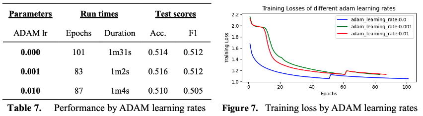
  <br>
  Impact of ADAM optimizaton
</p>

## F. SUMMARY

The strongest driver of performance in our models were the implementation of mini batch (which addresses run times) and early stopping (which addresses run times and overfitting). Variation of other parameters provided moderate benefits, but nothing as significant.

Several models with the best mix of run times, scores, and use cases are presented below. These models are the results of different stages of the experiment with representable test scores and run times.

<p align="center">
  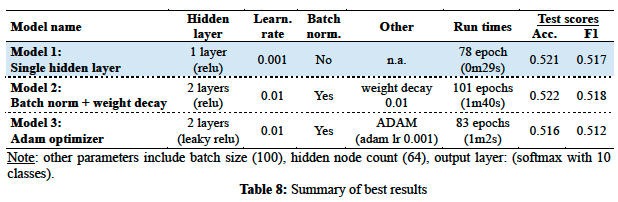
  <br>
  Summary of results
</p>

Recommendation: Model 1 (single hidden layer) is our best model as it has the lowest run times (2-3 times faster than other models considered), acceptable test scores (comparable to model 2) while being the simplest to implement. 

## G. DISCUSSION

The performance of a multilayer perceptron largely depends on hyperparameter tuning and empirical testing that results from optimizing the network. In this study, a supervised learning using a multi-layer perceptron was performed. To optimize a multi-layer perceptron, the important aspects needed to be considered are (i) convergence on training data, (ii) generalisability on test data, (iii) speed and simplicity.

This study encompassed all aspects to deduce a final model most suitable for the dataset. We note that the final model may not always be the ‘fanciest’ one, but one that is fit for purpose.

In terms of convergence on training data, the dropout rate, learning rate, batch sizes, width and depth of the hidden layers played the most significant roles in affecting convergence rate. In terms of model generalisability, the usage of validation data, batch normalisation, mini-batch and learning rate contributed the most the improvement of performance on an unseen dataset.   

The system of experiments and results highlighted the importance of empirical testing and evaluation metrics on optimizing a multi-layer perceptron. Due to the adherence to a strict testing and evaluation regime, we created an adequately robust multi-layer perceptron that generalizes well in unseen dataset along with establishing the goal of understanding how different deep learning optimisation techniques could contribute to model optimisation.

## H. APPENDIX

Parameters tested are highlighted in blue. Parameters chosen after testing are in bold:

<p align="center">
  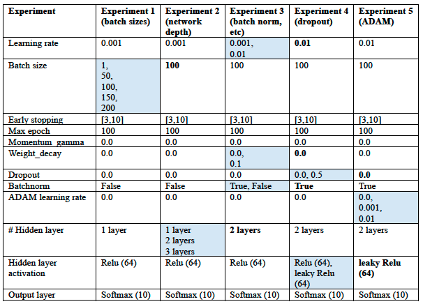
  <br>
  Parameters tested in blue, parameters chosen in bold
</p>

References:

Albon, C. (2018). Machine learning with python cookbook: Practical solutions from preprocessing to deep learning. " O'Reilly Media, Inc.".   
Al-Faiz, M. Z., Ibrahim, A. A., & Hadi, S. M. (2018). The effect of Z-Score standardization (normalization) on binary input due the speed of learning in back-propagation neural network. Iraqi Journal of Information and Communication Technology, 1(3), 42-48. 
Assos, A. (2023). Convergence of mini batch SGD Seminar in Undergrad Research, Massachusetts Institute of Technology. https://www.mit.edu/people/assos/files/6_UAR.pdf  
Goodfellow, I., Bengio, Y., & Courville, A. (2016). Deep learning. MIT press.   
Gordon-Rodriguez, E., Loaiza-Ganem, G., Pleiss, G., & Cunningham, J. P. (2020). Uses and Abuses of the Cross-Entropy Loss: Case Studies in Modern Deep Learning Proceedings on "I Can't Believe It's Not Better!" at NeurIPS Workshops, Proceedings of Machine Learning Research. https://proceedings.mlr.press/v137/gordon-rodriguez20a.html  
How does batch normalization affect the learning rate and the weight decay in neural networks?  Retrieved 2024-04-05 from https://www.linkedin.com/advice/0/how-does-batch-normalization-affect  
Kingma, D. P., & Ba, J. (2014). Adam: A method for stochastic optimization. arXiv preprint arXiv:1412.6980.   
Kurbiel, T. (2021). Derivative of the softmax function and the categorical cross-entropy loss. Retrieved 04-08 from https://towardsdatascience.com/derivative-of-the-softmax-function-and-the-categorical-cross-entropy-loss-ffceefc081d1  
LeCun, Y., Bengio, Y., & Hinton, G. (2015). Deep learning. Nature, 521(7553), 436-444. https://doi.org/10.1038/nature14539   
Patel, J. (2022, 03-30). Sigmoid function: derivative and working mechanism. Analytics Vidhya. https://www.analyticsvidhya.com/blog/2022/12/sigmoid-function-derivative-and-working-mechanism/  
Powers, D. M. (2020). Evaluation: from precision, recall and F-measure to ROC, informedness, markedness and correlation. arXiv preprint arXiv:2010.16061.   
Sharma, S. (2022). Activation functions in neural networks. Medium. Retrieved 30 March from https://towardsdatascience.com/activation-functions-neural-networks-1cbd9f8d91d6  
Sharma, S., Sharma, S., & Athaiya, A. (2017). Activation functions in neural networks. Towards Data Sci, 6(12), 310-316.   
Twomey, J. M., & Smith, A. E. (1997). Validation and verification. Artificial neural networks for civil engineers: Fundamentals and applications, 44-64.   
Vallés-Pérez, I., Soria-Olivas, E., Martínez-Sober, M., Serrano-López, A. J., Vila-Francés, J., & Gómez-Sanchís, J. (2023). Empirical study of the modulus as activation function in computer vision applications. Engineering Applications of Artificial Intelligence, 120, 105863. https://doi.org/https://doi.org/10.1016/j.engappai.2023.105863   
Wei, D. (2024, 5 April). Demystifying the adam optimizer in machine learning. Medium. https://medium.com/@weidagang/demystifying-the-adam-optimizer-in-machine-learning-4401d162cb9  


